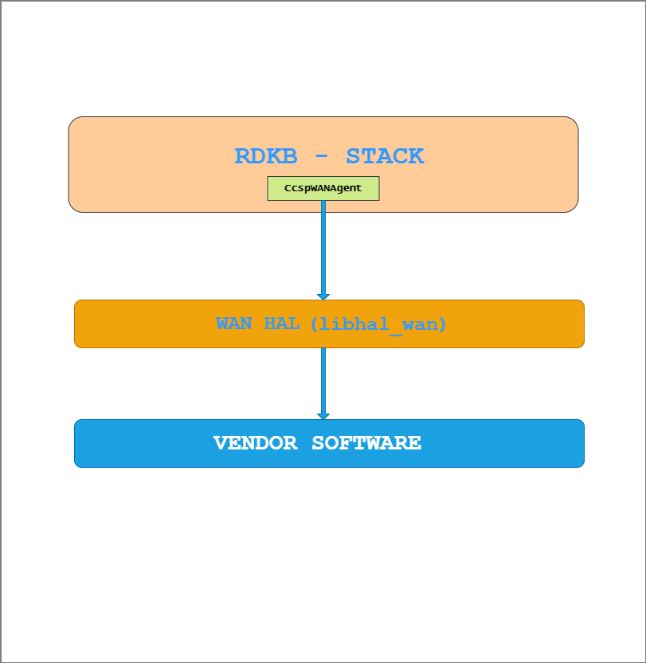
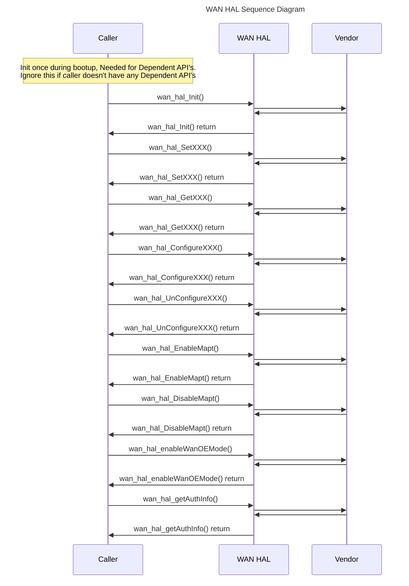

# WAN HAL Documentation

## Acronyms

- `HAL` \- Hardware Abstraction Layer
- `RDK-B` \- Reference Design Kit for Broadband Devices
- `OEM` \- Original Equipment Manufacture

## Description

The below diagram describes the high-level software architecture of the WAN HAL module stack.

WAN HAL is an abstraction layer implemented to interact with vendor software for setting specific details such as modes, connection enable / disable, QoS configuration, IPv4 / IPv6 config, MAP-T enable / disable, etc.

## Component Runtime Execution Requirements

### Initialization and Startup

The below initialization API provides an opportunity for the HAL code to initialize the appropriate DB's, start threads, etc.

The client is expected to call the corresponding API during the boot sequence.

- `wan_hal_Init()`

3rd party vendors will implement appropriately to meet operational requirements. This interface is expected to block if the hardware is not ready.

## Threading Model

The interface is not thread safe.

Any module that invokes the API should ensure calls are made in a thread-safe manner.

Vendors can create internal threads/events to meet their operation requirements. These should be responsible to synchronize between the calls, events and cleaned up on closure.

## Process Model

All APIs are expected to be called from multiple processes.

## Memory Model

The client is responsible for allocating and de-allocating memory for necessary APIs as specified in API documentation.

Different 3rd party vendors are allowed to allocate memory for internal operational requirements. In this case, 3rd party implementations should be responsible to deallocate internally.

TODO:
State a footprint requirement. Example: This should not exceed XXXX KB.

## Power Management Requirements

The HAL is not involved in any of the power management operations.

Any power management state transitions MUST not affect the operation of the HAL.

## Asynchronous Notification Model

There are no asynchronous notifications.

## Blocking calls

The API's are expected to work synchronously and should complete within a time period commensurate with the complexity of the operation and in accordance with any relevant specification.

Any calls that can fail due to the lack of a response should have a timeout period in accordance with any API documentation.

TODO:
As we state that they should complete within a time period, we need to state what that time target is, and pull it from the spec if required. Define the timeout requirement.

## Internal Error Handling

All the WAN HAL APIs should return errors synchronously as a return argument. HAL is responsible for handling system errors (e.g., out of memory) internally.

## Persistence Model

There is no requirement for HAL to persist any setting information. The caller is responsible for persisting any settings related to their implementation.

## Nonfunctional requirements

Following non functional requirement should be supported by the component.

## Logging and debugging requirements

The component should log all the error and critical informative messages, preferably using syslog, printf which helps to debug/triage the issues and understand the functional flow of the system.

The logging should be consistent across all HAL components.

If the vendor is going to log then it has to be logged in `xxx_vendor_hal.log` file name which can be placed in `/rdklogs/logs/` or `/var/tmp/` directory.

Logging should be defined with log levels as per Linux standard logging.

## Memory and performance requirements

The component should not contribute more to memory and CPU utilization while performing normal operations and should be commensurate with the operation required.

## Quality Control

WAN HAL implementation should pass checks using any third party tools like `Coverity`, `Black duck`, `Valgrind` etc. without any issue to ensure quality.

There should not be any memory leaks or corruption introduced by HAL and underneath 3rd party software implementation.

## Licensing

WAN HAL implementation is expected to be released under the Apache License 2.0.

## Build Requirements

The source code should be able to be built under Linux Yocto environment and should be delivered as a shared library `libhal_wan.so`

## Variability Management

Changes to the interface will be controlled by versioning, vendors will be expected to implement to a fixed version of the interface, and based on SLA agreements move to later versions as demand requires.

Each API interface will be versioned using [Semantic Versioning 2.0.0](https://semver.org/), the vendor code will comply with a specific version of the interface.

## WAN or Product Customization

None

## Interface API Documentation

All HAL function prototypes and datatype definitions are available in `wan_hal.h` file.

1.  Components/Process must include `wan_hal.h` to make use of WAN hal capabilities.
2.  Components/Process should add linker dependency for `libhal_wan.so`

## Theory of operation and key concepts

Covered as per the "Description" sections in the API documentation.

## Sequence Diagram

